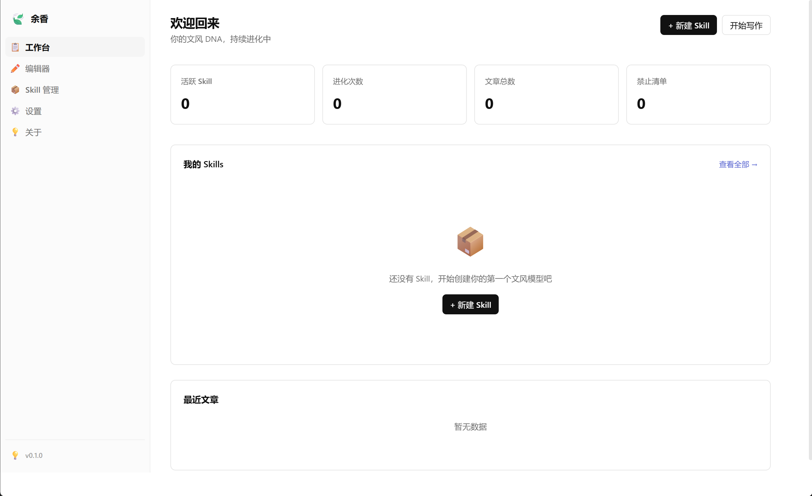
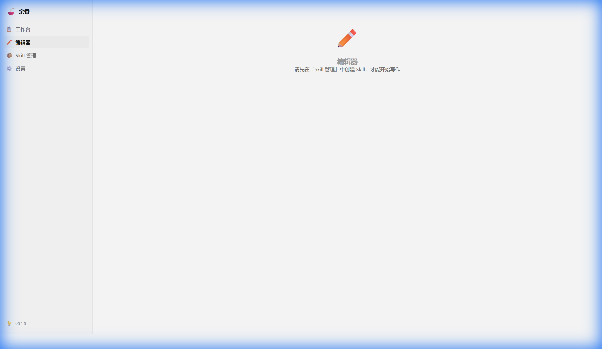
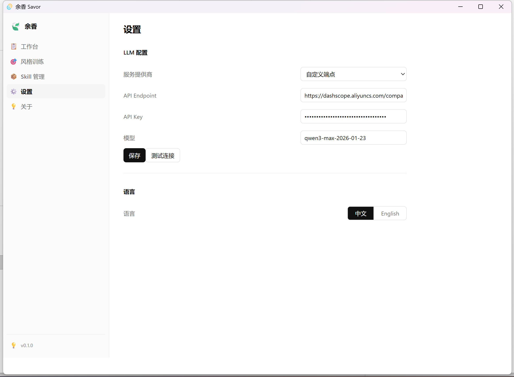
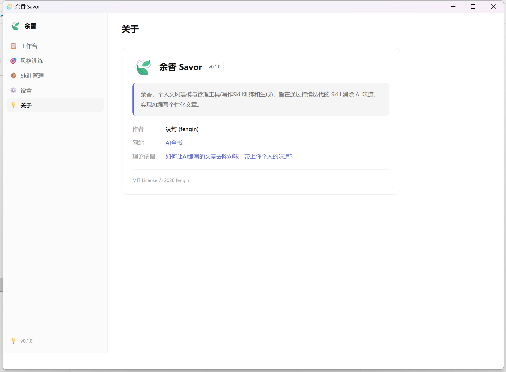

<p align="center">
  <span style="font-size: 60px">🍃</span>
</p>

<h1 align="center">余香 Savor</h1>

<p align="center">
  <strong>个人化文风资产建模与管理工具</strong><br>
  通过持续迭代的 Skill 消除 AI 味道，实现个人化文章写作特点
</p>

<p align="center">
  <a href="https://github.com/fengin/umani/actions"></a>
  <a href="https://github.com/fengin/umani/releases"></a>
  <a href="./LICENSE"></a>
</p>

---

## 🤔 这是什么？

AI 写的文章总有一股"AI 味"——用词华丽但千篇一律。**余香**帮你解决这个问题。

它通过分析你对 AI 文章的修改习惯（Diff），自动提炼出你独特的**写作风格规则（Skill）**，并随着你的每次修改持续**进化**。下次 AI 写作时，就能带上你个人的味道。

> 📖 理论依据：[如何让 AI 编写的文章去除 AI 味，带上你个人的味道？](https://aibook.ren/archives/how-to-write-without-ai-taste)

## ✨ 核心特性

- 🧠 **Skill 引擎** — 自动从 Diff 中提炼写作风格规则，支持多维度分类
- 🔄 **持续进化** — 每次修改都让 Skill 更精准，越用越懂你
- 📝 **内置编辑器** — Monaco Editor + Diff 双栏对比，所见即所得
- 📦 **版本管理** — Skill 完整版本历史，可随时回滚
- 📤 **多格式导出** — 支持 Markdown / JSON 导出，方便在其他 AI 工具中使用
- 🌍 **中英双语** — 界面支持中文和英文切换
- 🔌 **多 LLM 支持** — 兼容 OpenAI / DeepSeek / 本地 Ollama 等 API

## 📸 截图预览

| 工作台                               | 编辑器                            |
| ------------------------------------ | --------------------------------- |
|  |  |

| 设置                              | 关于                           |
| --------------------------------- | ------------------------------ |
|  |  |

## 🚀 快速开始

### 安装包（推荐）

前往 [Releases](https://github.com/fengin/umani/releases) 下载对应平台的安装包：

| 平台    | 格式                   |
| ------- | ---------------------- |
| Windows | `.msi` / `.exe` (NSIS) |
| macOS   | `.dmg`                 |
| Linux   | `.deb` / `.AppImage`   |

### 从源码构建

#### 环境要求

- [Rust](https://www.rust-lang.org/tools/install) ≥ 1.70
- [Node.js](https://nodejs.org/) ≥ 18
- [Tauri CLI](https://v2.tauri.app/start/prerequisites/)

#### 构建步骤

```bash
# 克隆仓库
git clone https://github.com/fengin/umani.git
cd umani

# 安装前端依赖
npm install

# 开发模式（带热重载）
npm run tauri dev

# 构建安装包
npm run tauri build
```

## 🏗️ 技术架构

```
余香 Savor
├── 前端 (React + TypeScript + Vite)
│   ├── Monaco Editor — 代码级编辑体验
│   ├── Zustand — 轻量状态管理
│   ├── i18next — 国际化
│   └── React Router — SPA 路由
├── 后端 (Rust + Tauri v2)
│   ├── SQLite (rusqlite) — 本地数据存储
│   ├── Reqwest — LLM API 通信
│   ├── Similar — Diff 计算引擎
│   └── Serde — 序列化/反序列化
└── 构建 & CI/CD
    ├── Vite — 前端构建 + HMR
    ├── Cargo — Rust 构建
    └── GitHub Actions — CI 测试 + 三平台发布
```

## 📁 项目结构

```
umani/
├── src/                    # 前端源码
│   ├── components/         # 通用组件 (Sidebar)
│   ├── pages/              # 页面 (Workspace/Editor/Skills/Settings/About)
│   ├── services/           # API 层 (skillApi/articleApi/llmApi)
│   ├── locales/            # 国际化 (zh-CN/en-US)
│   ├── styles/             # 全局样式 & 设计系统
│   └── types/              # TypeScript 类型定义
├── src-tauri/              # Rust 后端
│   ├── src/
│   │   ├── commands/       # Tauri IPC 命令
│   │   ├── db/             # 数据库 Schema & 操作
│   │   ├── models/         # 数据模型
│   │   ├── services/       # LLM 服务层
│   │   ├── prompts/        # 提示词模板
│   │   └── tests.rs        # 单元测试 (51 tests)
│   └── icons/              # 应用图标
└── .github/workflows/      # CI/CD
```

## 🧪 测试

```bash
# 运行 Rust 后端单元测试 (51 tests)
cd src-tauri && cargo test

# TypeScript 类型检查
npx tsc --noEmit

# 前端构建验证
npm run build
```

## 🤝 贡献

欢迎提交 Issue 和 Pull Request！

1. Fork 本仓库
2. 创建特性分支 (`git checkout -b feature/amazing-feature`)
3. 提交更改 (`git commit -m 'feat: add amazing feature'`)
4. 推送到分支 (`git push origin feature/amazing-feature`)
5. 提交 Pull Request

## 📄 许可证

[MIT License](./LICENSE) © 2026 [fengin](https://github.com/fengin)

## 🔗 相关链接

- 🌐 [AI全书](https://aibook.ren) — 作者博客
- 📖 [理论依据](https://aibook.ren/archives/how-to-write-without-ai-taste) — 如何让 AI 编写的文章去除 AI 味，带上你个人的味道？
