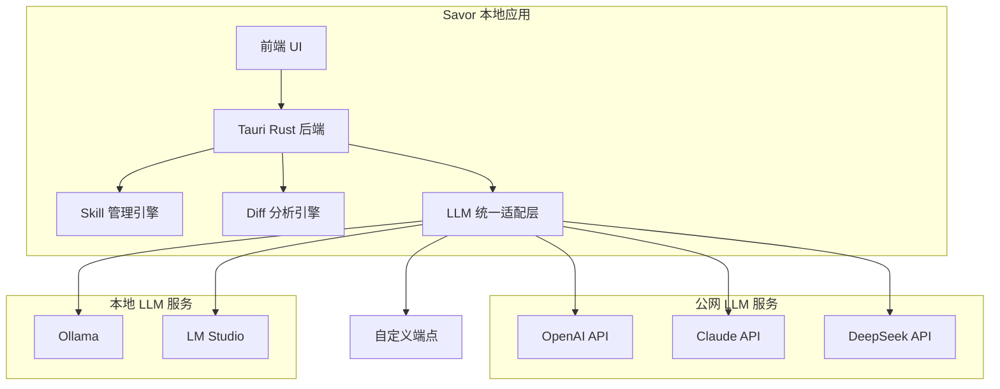
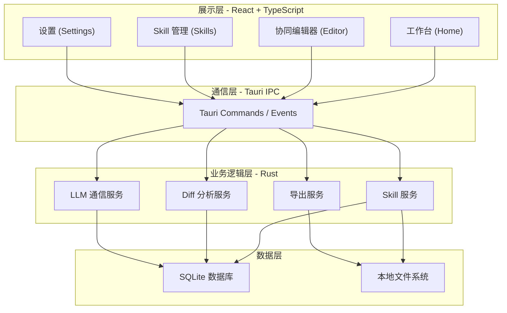
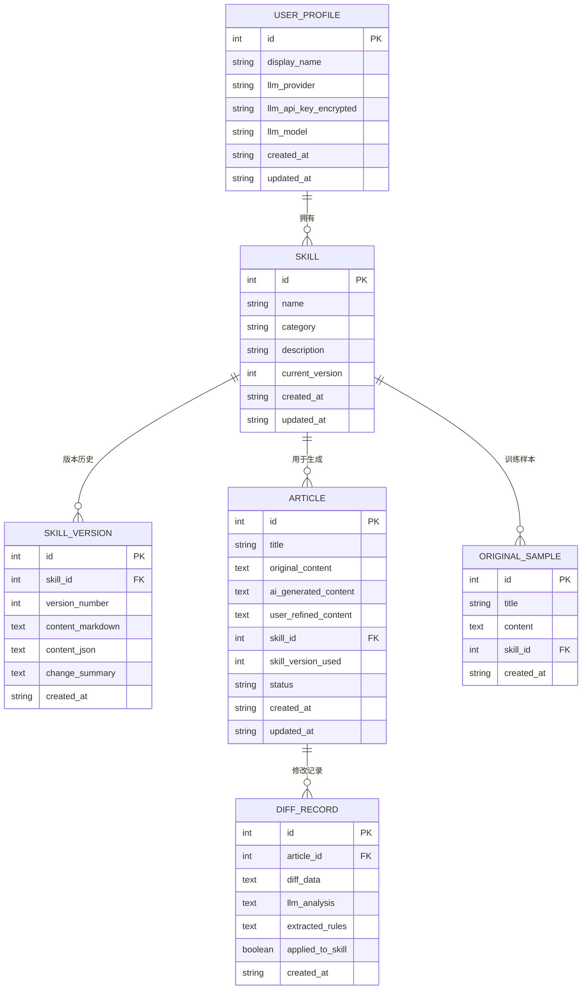
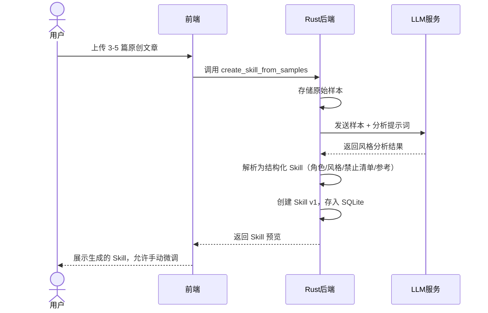
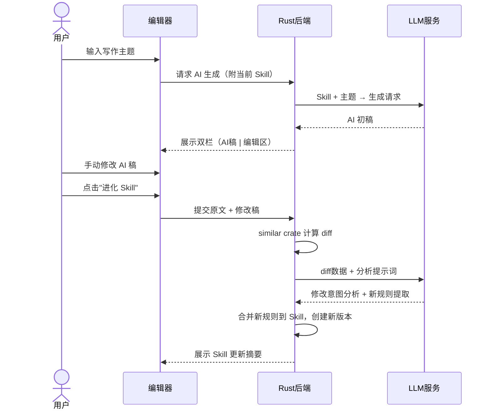
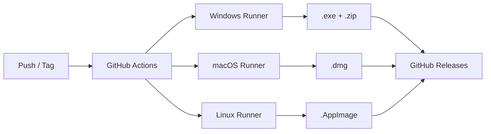

# Savor (余香) 技术方案设计文档

## 一、产品概述

**Savor (余香)** 是一款个人化文风资产建模与管理平台，工程代号 **Umami**。核心理念是通过构建持续进化的 Writing Style Skill（写作风格技能），让 AI 真正学会用户独一无二的写作风格，从而消除 AI 生成内容的同质化"AI 味"。

### 核心用户流程


---

## 二、技术参数约束

根据需求背景，以下几条是硬性约束：

| 约束项       | 要求                         | 设计策略                                                                                          |
| ------------ | ---------------------------- | ------------------------------------------------------------------------------------------------- |
| **跨平台**   | 支持 Windows / macOS / Linux | 采用 Tauri 2.x 框架，利用系统原生 WebView 渲染                                                    |
| **免安装**   | 下载后直接打开使用           | Windows 打包为便携 `.exe` + `.zip`；macOS 打包为 `.dmg`；Linux 打包为 `.AppImage`                 |
| **轻量高效** | 运行速度快，内存占用小       | Tauri 应用启动内存约 30-50MB，安装包 ≤ 10MB（远优于 Electron 的 150-300MB 内存、80-150MB 安装包） |

---

## 三、技术选型

### 3.1 应用框架：Tauri 2.x

**选型理由：**

- **极小的包体积**：最小包可 < 3MB，典型应用 5-10MB
- **极低内存占用**：启动内存 30-50MB（对比 Electron 150-300MB）
- **原生 WebView**：使用系统内置渲染引擎（Windows: WebView2, macOS: WebKit, Linux: WebKitGTK），无需捆绑 Chromium
- **Rust 后端**：高性能、内存安全，天然适合文本处理密集型场景
- **跨平台内置支持**：bundler 直接生成三平台安装包/便携包

> [!NOTE]
> Windows 上需要 WebView2 运行时，Win10 1803+ 及 Win11 已预装。对于极少数旧系统，可在首次启动时提示用户安装（约 1.8MB 引导包），或选择使用 Tauri 的 `embedBootstrapper` 模式捆绑。

### 3.2 前端：React + TypeScript + Vite

| 技术              | 理由                                                                |
| ----------------- | ------------------------------------------------------------------- |
| **React 19**      | 组件化架构，生态丰富，diff 编辑器组件成熟                           |
| **TypeScript**    | 类型安全，适合复杂状态管理（Skill 版本、编辑状态等）                |
| **Vite**          | 极快的 HMR 开发体验，Tauri 官方推荐                                 |
| **Monaco Editor** | VS Code 同款编辑器引擎，支持双栏 diff 对比、语法高亮、Markdown 预览 |
| **react-i18next** | 成熟的 React 国际化方案，支持中英文双语言，默认中文                 |

### 3.3 后端（Rust 层）

| 组件          | 技术选择                 | 说明                                              |
| ------------- | ------------------------ | ------------------------------------------------- |
| **本地存储**  | SQLite（via `rusqlite`） | 轻量嵌入式数据库，无需额外安装数据库服务          |
| **文件管理**  | Rust std::fs + `serde`   | Skill 文档以 JSON/Markdown 存储在本地文件系统     |
| **Diff 引擎** | `similar` crate          | 高性能文本差异分析，支持字/行/语义级别            |
| **LLM 通信**  | `reqwest`                | 调用外部 LLM API（OpenAI / Claude / DeepSeek 等） |

### 3.4 LLM 集成策略

> [!NOTE]
> Savor 本身**不内嵌大模型**，而是通过**统一的 API 适配层**对接 LLM 服务。无论是公网平台（OpenAI / Claude / DeepSeek）还是本地部署的模型（Ollama / LM Studio），本质上都是 HTTP API 调用，区别仅在于 endpoint 地址不同。这保持了应用的轻量特性，同时提供了最大的模型灵活性。



用户可在设置中配置：
- **API Provider**：选择预设的 OpenAI / Claude / DeepSeek / Ollama / LM Studio，或自定义兼容 OpenAI 格式的端点
- **API Endpoint**：自动填充或手动指定（本地模型如 `http://localhost:11434`）
- **API Key**：加密存储在本地（本地模型可留空）
- **Model**：根据 Provider 自动列出或手动填写可用模型

---

## 四、系统架构设计

### 4.1 整体架构



### 4.2 数据模型



### 4.3 核心数据流

#### 流程一：初始化建模（Set Base）



#### 流程二：写作 + 调味进化循环



---

## 五、功能模块详细设计

### 5.1 工作台 (Home)

首页提供快速入口和总览信息：

- **快速操作**：新建 Skill / 开始写作 / 导入文章
- **Skill 卡片列表**：展示所有 Skill 的名称、分类、版本号、最近使用时间
- **最近文章**：近期编辑的文章快速入口

### 5.2 文风建模引擎

**原创样本导入**支持：
- 直接粘贴文本
- 上传 `.txt` / `.md` 文件
- 批量导入

**特征提取**通过精心设计的分析提示词，引导 LLM 从样本中提取四个维度：

| 维度         | 提取内容                | 示例                                         |
| ------------ | ----------------------- | -------------------------------------------- |
| **角色定位** | 身份、语气、读者画像    | "产品经理，同事聊天口吻，读者是技术背景的人" |
| **风格要点** | 3-5 条核心写作原则      | "说人话"、"有观点有态度"、"教程具体可执行"   |
| **禁止清单** | AI 味词汇 / 句式 / 结构 | 禁止"深耕"、"赋能"、"首先其次最后"           |
| **参考资料** | 术语表、范文特征        | 特定领域术语的处理方式                       |

### 5.3 协同编辑器

基于 **Monaco Editor** 实现的双栏对比编辑环境：

- **左栏**：AI 生成的原文（只读）
- **右栏**：用户编辑区（可修改）
- **Diff 高亮**：实时标注两者差异（增/删/改）
- **工具栏**：
  - 「重新生成」：用当前 Skill 重新生成
  - 「进化 Skill」：触发 diff 分析并更新 Skill
  - 「采纳修改」：将右栏内容保存为最终版
  - 「导出」：Markdown / 纯文本

### 5.4 Skill 资产管理

- **多场景分类**：科技评论、生活笔记、产品文档等标签化管理
- **版本控制**：
  - 每次更新自动创建新版本
  - 版本列表展示变更摘要
  - 一键回滚到任意历史版本
  - Diff 对比任意两个版本
- **Skill 预览与编辑**：Markdown 格式的 Skill 文档，支持直接编辑
- **风格评分**（MVP 后期）：基于语义相似度量化 AI 对用户风格的还原程度

### 5.5 导出功能

将成熟 Skill 导出为通用格式，适配主流 AI 平台：

- **Markdown 格式**：结构化的 System Prompt，可直接粘贴到 ChatGPT / Claude 对话
- **JSON 格式**：供 Dify / Coze 等 Agent 平台调用的结构化数据
- **剪贴板快速复制**：一键复制 Skill 到剪贴板

### 5.6 设置页面

- **LLM 配置**：Provider / API Key / Model 选择
- **更新模式**：自动模式 / 手动模式切换
- **语言切换**：中文（默认）/ English，切换后立即生效
- **数据管理**：导入/导出全部数据、清除缓存
- **关于**：版本信息、开源许可

---

## 六、项目工程结构

```
umani/
├── src-tauri/                    # Tauri Rust 后端
│   ├── Cargo.toml
│   ├── tauri.conf.json           # Tauri 配置（窗口、打包、权限等）
│   ├── src/
│   │   ├── main.rs               # 入口
│   │   ├── lib.rs                # 模块导出
│   │   ├── commands/             # Tauri IPC 命令
│   │   │   ├── mod.rs
│   │   │   ├── skill.rs          # Skill CRUD /版本管理
│   │   │   ├── article.rs        # 文章生成/保存
│   │   │   ├── diff.rs           # Diff 分析与规则提取
│   │   │   ├── llm.rs            # LLM 通信
│   │   │   └── export.rs         # Skill 导出
│   │   ├── services/             # 业务逻辑
│   │   │   ├── mod.rs
│   │   │   ├── skill_service.rs
│   │   │   ├── diff_service.rs
│   │   │   ├── llm_service.rs
│   │   │   └── export_service.rs
│   │   ├── models/               # 数据模型
│   │   │   ├── mod.rs
│   │   │   ├── skill.rs
│   │   │   ├── article.rs
│   │   │   └── diff.rs
│   │   ├── db/                   # 数据库
│   │   │   ├── mod.rs
│   │   │   ├── schema.rs         # 表结构定义
│   │   │   └── migrations/       # 数据库迁移
│   │   └── prompts/              # LLM 提示词模板
│   │       ├── analyze_style.rs  # 风格分析提示词
│   │       ├── generate.rs       # 写作生成提示词
│   │       └── diff_analyze.rs   # Diff 分析提示词
│   └── icons/                    # 应用图标
│
├── src/                          # React 前端
│   ├── main.tsx                  # 入口
│   ├── App.tsx                   # 根组件 + 路由
│   ├── pages/                    # 页面组件
│   │   ├── Home.tsx              # 工作台首页
│   │   ├── Editor.tsx            # 协同编辑器
│   │   ├── Skills.tsx            # Skill 管理列表
│   │   ├── SkillDetail.tsx       # Skill 详情/编辑
│   │   └── Settings.tsx          # 设置
│   ├── components/               # 通用组件
│   │   ├── DiffEditor.tsx        # 双栏 Diff 编辑器
│   │   ├── SkillCard.tsx         # Skill 卡片
│   │   ├── SkillPreview.tsx      # Skill 预览
│   │   ├── ArticleList.tsx       # 文章列表
│   │   └── FileUploader.tsx      # 文件上传组件
│   ├── hooks/                    # 自定义 Hooks
│   │   ├── useSkill.ts           # Skill 相关操作
│   │   ├── useLLM.ts             # LLM 调用
│   │   └── useSettings.ts        # 设置管理
│   ├── services/                 # Tauri IPC 调用封装
│   │   ├── api.ts                # 统一 invoke 封装
│   │   ├── skillApi.ts           # Skill 相关 API
│   │   ├── articleApi.ts         # 文章相关 API
│   │   └── llmApi.ts             # LLM 相关 API
│   ├── locales/                  # 国际化资源
│   │   ├── i18n.ts               # i18next 初始化配置
│   │   ├── zh-CN.json            # 中文语言包（默认）
│   │   └── en-US.json            # 英文语言包
│   ├── stores/                   # 状态管理
│   │   └── appStore.ts           # 全局状态（zustand）
│   ├── styles/                   # 样式
│   │   ├── index.css             # 全局样式 & 设计令牌
│   │   ├── editor.css
│   │   └── skills.css
│   └── types/                    # TypeScript 类型定义
│       └── index.ts
│
├── index.html
├── package.json
├── tsconfig.json
├── vite.config.ts
├── 需求文档.md
└── 去 AI 味提示词：一场集体幻觉.md
```

---

## 七、跨平台打包与分发

### 7.1 打包配置

Tauri 内置 bundler 支持以下格式：

| 平台        | 格式                            | 免安装方式             | 说明                       |
| ----------- | ------------------------------- | ---------------------- | -------------------------- |
| **Windows** | `.exe` (NSIS) + portable `.zip` | 解压即用               | 包含可执行文件和必要的 dll |
| **macOS**   | `.dmg` / `.app`                 | 拖拽到应用程序文件夹   | 标准的 macOS 应用分发方式  |
| **Linux**   | `.AppImage`                     | 下载后 `chmod +x` 运行 | 无需安装，自包含运行环境   |

### 7.2 CI/CD 流程

推荐使用 **GitHub Actions** 实现自动化构建与发布：



---

## 八、已确认的设计决策

| 决策项       | 结论                                                                                                              |
| ------------ | ----------------------------------------------------------------------------------------------------------------- |
| **LLM 集成** | 统一 API 适配层，同时支持公网平台（OpenAI/Claude/DeepSeek）和本地模型（Ollama/LM Studio），本质均为 HTTP API 调用 |
| **功能范围** | MVP 先实现核心循环，后续快速迭代风格评分、团队风格库、实时去味监控、模型调优等功能（不含移动端）                  |
| **数据隐私** | 所有数据本地存储，仅 LLM API 调用联网                                                                             |
| **UI 风格**  | **Style B3 (Linear / Bold Minimal)** - 详见 [视觉设计规范](design_guide.md)                                       |
| **多语言**   | 内置中英文双语言（react-i18next），默认中文，设置中可切换                                                         |

---

## 九、开发阶段划分

### 阶段 1：项目骨架（预计 2-3 天）
- Tauri + React + TypeScript 项目初始化
- 路由框架搭建
- 基础 UI 组件库
- SQLite 数据库初始化

### 阶段 2：核心引擎（预计 5-7 天）
- LLM 通信适配层
- 文风分析提示词工程
- Skill 数据模型与 CRUD
- 版本控制系统

### 阶段 3：编辑器（预计 4-5 天）
- Monaco Editor 集成
- 双栏 Diff 对比
- Diff 分析与规则提取
- Skill 自动/手动更新

### 阶段 4：管理与导出（预计 2-3 天）
- Skill 列表与详情页
- 版本回滚
- Markdown / JSON 导出
- 设置页面

### 阶段 5：打包与优化（预计 2-3 天）
- 三平台打包配置
- GitHub Actions CI/CD
- 性能优化
- 用户体验打磨

**总计预估：15-21 天**

---

## 十、验证计划

### 自动化测试

- **Rust 单元测试**：`cargo test` —— 覆盖 Skill CRUD、Diff 引擎、导出格式化
- **前端组件测试**：`vitest` —— 覆盖 hooks、API 调用封装、状态管理
- **E2E 测试**：Tauri 提供的 WebDriver 测试能力

### 手动验证

1. **跨平台构建验证**：在 Windows / macOS / Linux 上分别构建并运行
2. **免安装验证**：确认各平台的便携包可直接运行，无需安装步骤
3. **核心流程验证**：完整走通 "上传样本 → 生成 Skill → AI写作 → 修改 → 进化 Skill" 循环
4. **性能验证**：监测启动时间和内存占用，确保满足轻量目标
